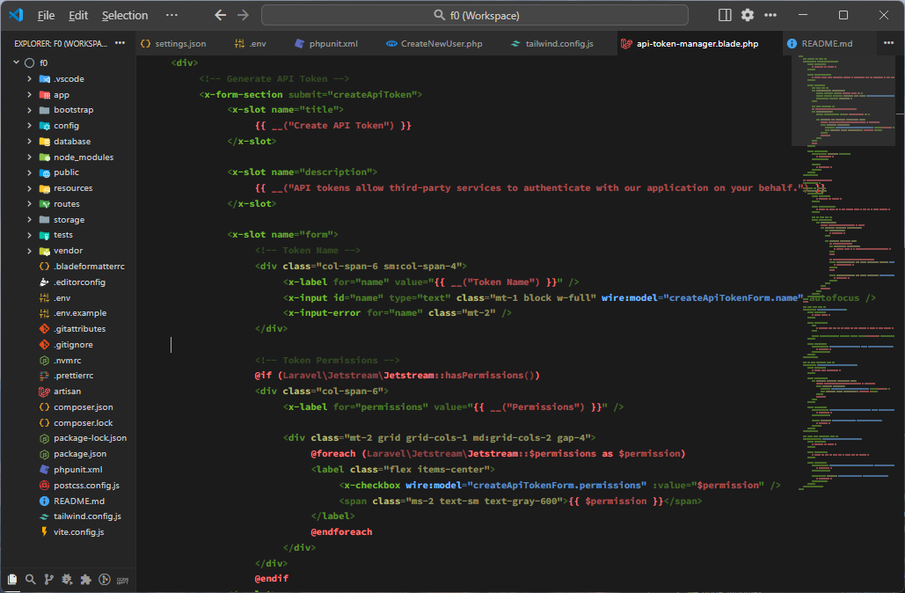

# Infinity 64 Theme for VS Code by Shingo Murata

## Infinity 64 themes feature monochrome syntax highlighting

This theme is inspired by minimal black & white themes I made and contains both light & dark modes:

1. Infinity 64 Whiteboard
2. Infinity 64 Blackboard

Thanks to Big Al complex highlighters seem redundant in 2025 inviting this next logical step.

## Version 1.0.0 supports 18 syntaxes with most others pending

- HTML & XML (green);
- PHP & C++ & Rust (red);
- JavaScript & Livewire (blue);
- CSS & Tailwind (yellow);
- JSON & Yaml (pink);
- Editorconfig & env & INI (purple);
- Shell (orange);
- HTMX (magenta);
- Markdown (mint);
- Django (violet).

---

## Optional settings overlay for text decorations

Whilst no decorations are often preferential some fonts (eg. Iosevka, Hasklig, TheSansMono) do handle them well:

```json
{
	"editor.tokenColorCustomizations": {
		"[Infinity 64 Blackboard by Shingo Murata]": {
			"numbers":   { "fontStyle": "bold", },
			"functions": { "fontStyle": "bold", },
			"keywords":  { "fontStyle": "bold", },
			"types":     { "fontStyle": "italic underline", },
			"variables": { "fontStyle": "italic", },
			"strings":   { "fontStyle": "italic", },
			"comments":  { "fontStyle": "italic", },
			"textMateRules": [
				{ "scope": ["punctuation"], "settings": { "fontStyle": "", }, },
				{ "scope": ["constant", "support.constant", "keyword.operator", "keyword.blade", "constant.character.escape", "meta.selector.css", "markup.bold", "meta.tag.metadata.doctype", "meta.tag.preprocessor", "punctuation.section.embedded.begin.php", "comment.line.shebang", "keyword.other.definition.root", "keyword.operator.assignment.env", "keyword.core.apacheconf", "string.replacement.apacheconf", "keyword.directive.nginx", "entity.name.tag.yaml"], "settings": { "fontStyle": "bold", }, },
				{ "scope": ["meta.section.header", "meta.section.header punctuation", "keyword.operator.glob", "entity.name.tag.namespace.xml"], "settings": { "fontStyle": "underline", }, },
				{ "scope": ["variable.language.this", "variable.other.readwrite", "variable.other.object", "markup.heading", "markup.heading punctuation", "variable.other.env", "entity.tag.apacheconf", "storage.type.directive.context.nginx", "entity.name.scope-resolution.c", "entity.name.scope-resolution.cpp", "punctuation.separator.scope-resolution.c", "punctuation.separator.scope-resolution.cpp"], "settings": { "fontStyle": "italic underline", }, },
				{ "scope": ["variable.other.object.property", "markup.italic.markdown", "punctuation.variable.apacheconf", "punctuation.definition.variable.nginx", "meta.method-call entity.name.function"], "settings": { "fontStyle": "italic", }, },
				
				{ "scope": ["comment.block punctuation.definition", "comment.block storage.type", "comment.block storage.type.class", "keyword.operator.expression.typeof", "keyword.operator.type", "punctuation.definition.template-expression.begin", "punctuation.definition.template-expression.end"], "settings": { "fontStyle": "italic", }, },
				{ "scope": ["entity.name.tag", "punctuation.definition.tag.xml", "entity.name.tag.xml", "entity.name.tag.localname.xml", "storage.modifier", "source.json support.type", "markup.inline", "punctuation.section.arguments", "punctuation.separator.inheritance", "meta.brace.round"], "settings": { "fontStyle": "italic", }, },
				{ "scope": ["entity.other.inherited-class", "storage.type.built-in", "source.json support.type", "meta.tag.custom entity.name.tag", "variable.other.object"], "settings": { "fontStyle": "italic underline", }, },
				{ "scope": ["markup.heading markup.bold", "markup.heading punctuation", "variable.other.readwrite", "punctuation.definition.heading.markdown"], "settings": { "fontStyle": "bold underline", }, },
				{ "scope": ["punctuation.definition.heading", "punctuation.section.editorconfig", "keyword.operator.glob", "markup.heading"], "settings": { "fontStyle": "bold underline", }, },
				{ "scope": ["meta.section.header.editorconfig", "meta.section.header.editorconfig punctuation", "meta.section.header.editorconfig punctuation.definition"], "settings": { "fontStyle": "bold underline", }, },
				{ "scope": ["punctuation.section.brace.bracket.square.begin.editorconfig", "punctuation.section.brace.bracket.square.end.editorconfig"], "settings": { "fontStyle": "bold underline", }, },
				{ "scope": ["storage.type.template", "entity.other.attribute-name.namespace.xml"], "settings": { "fontStyle": "underline", }, },
				{ "scope": ["storage.type.template.argument", "keyword.operator.bitwise", "fenced_code.block.language", "keyword.control.flow", "constant.other.option", "support.function.construct.begin.blade", "support.function.construct.end.blade"], "settings": { "fontStyle": "bold", }, },
				{ "scope": ["storage.type", "keyword.control.from", "keyword.control.default", "constant.character", "constant.character.escape", "keyword.operator", "storage.type.function.arrow", "punctuation.separator.scope-resolution", "variable punctuation.definition", "meta.function-call entity.name.function"], "settings": { "fontStyle": "", }, },
			],
		},
	},
}
```





---

## Recommended settings for a minimal interface

```json
{
	"editor.bracketPairColorization.enabled": false,
	"editor.guides.bracketPairs": false,
	"editor.guides.indentation": false,
	"editor.lineNumbers": "off",
	"editor.minimap.renderCharacters": false,
	"editor.minimap.scale": 1,
	"editor.renderLineHighlight": "none",
	"editor.scrollbar.vertical": "hidden",
	"editor.scrollbar.horizontal": "hidden",
	"window.autoDetectColorScheme": true,
	"window.systemColorTheme": "auto",
	"workbench.preferredDarkColorTheme": "Infinity 64 Blackboard by Shingo Murata",
	"workbench.preferredLightColorTheme": "Infinity 64 Whiteboard by Shingo Murata",
}
```

[](XMR```43shingofqi5gRhYBft6ErCEZEZbZGDLB3AAiw39gnE31Cjq3cKwrVhKRoSoGj5CMQWqhLMtN21rmgXYHSo2dkXG9Aj7gwa```)